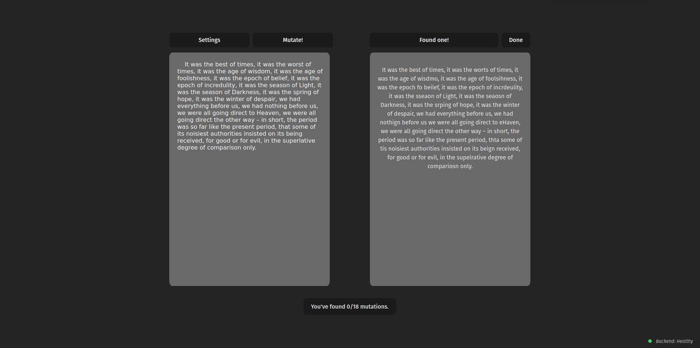

# Text Mutator



A [web app](https://happy-rock-0d924d903.6.azurestaticapps.net/) that deliberately introduces minor errors into text to aid proofreading.

## Why?

Every writer's had the experience of glossing over obvious typos in a text because they're too familiar with it; those pernicious errors that have a penchant for only becoming visible the moment you hit 'publish'.

This app warps your text in small ways that force you to read it carefully, with fresh eyes, on a word-by-word level. The intent is that this will let you see the text with fresh eyes and thus appreciate other small errors (not introduced by the app) which you can then fix.

## Features

- Swap adjacent letters
- Remove punctuation
- Replace words with homophones (your/you're, their/there/they're, etc.)
- Configurable mutation rate
- Configurable seed for determinism

## Implementation, installation, testing

The app has three main moving parts.

- A React front-end, using Vite.
- A HTTP API in Rust.
- Bicep files for infrastructure-as-code deployment.

```bash
git clone https://github.com/jkendall327/text-mutator
cd text-mutator
```

For the backend:
```bash
cd backend
cargo test
cargo run
```

For the frontend:
```bash
cd backend
npm run test
npm run dev
```

For deployment, `cd` into `text-mutator/.infra` and use the `az deployment` comnands.
I haven't yet invested effort in making the Bicep files tenancy-agnostic, so you may have to change some parameters for your Azure environment.

## License

MIT.
